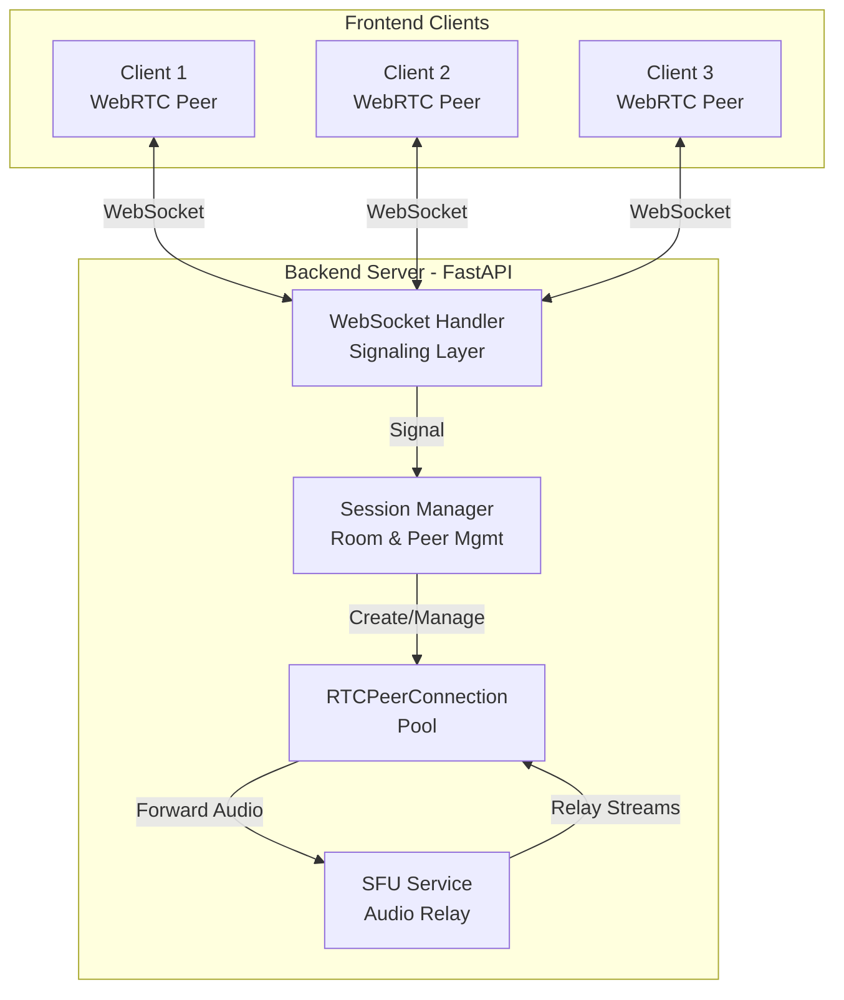
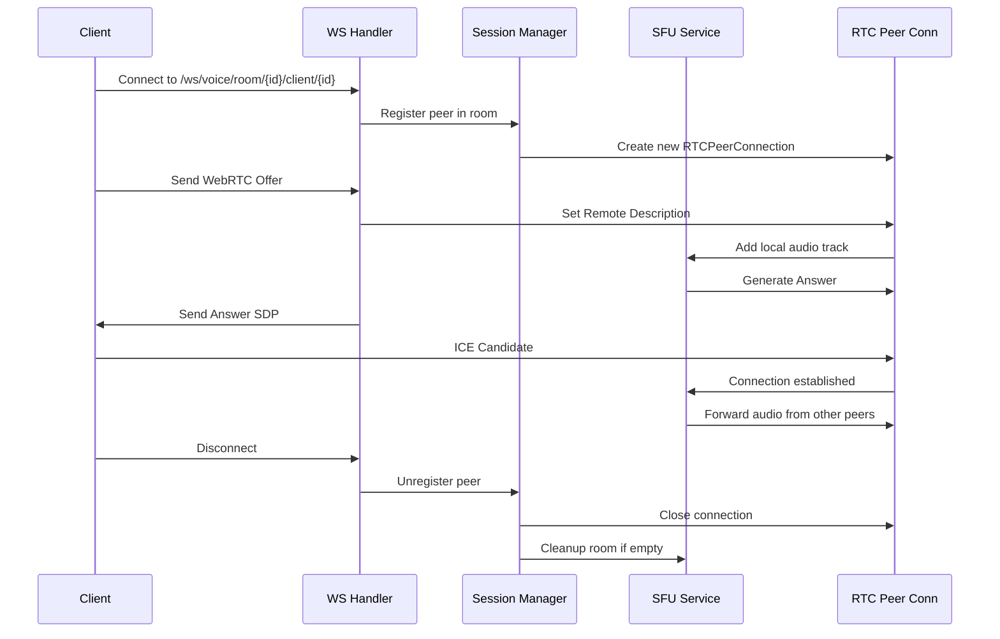
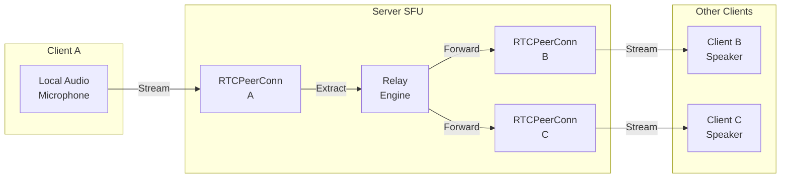

# Voice SDK - WebRTC SFU MVP

## Overview

A voice communication SDK implementing a **Selective Forwarding Unit (SFU)** architecture for multi-party voice chat. The server acts as a relay point that forwards audio streams between peers rather than requiring direct peer-to-peer connections.

## System Architecture



## Tech Stack

- **Backend**: FastAPI + aiortc (WebRTC library on asyncio)
- **Frontend**: HTML/JavaScript
- **Protocol**: WebRTC (peer connections) + WebSocket (signaling)
- **Dependencies**: FastAPI, Uvicorn, Pydantic, websockets, aiortc

## Project Structure

```
backend/
├── main.py                 # FastAPI app initialization
├── config/
│   └── config.py          # Settings & environment variables
├── routes/
│   ├── signaling.py       # WebSocket signaling endpoints
│   └── sessions.py        # Session management routes
├── services/
│   ├── session_manager.py # Room & peer lifecycle management
│   └── sfu_service.py     # Audio relay & stream handling
└── models/
    └── schema.py          # Pydantic data models

frontend/
├── index.html             # Web interface
├── script.js              # WebRTC client logic
└── style.css              # Styling
```

## Session Flow



## Implementation Details

### 1. **Session Manager** (`session_manager.py`)

- Manages room lifecycle and peer registration
- Tracks active connections per room
- Triggers cleanup when rooms become empty

### 2. **SFU Service** (`sfu_service.py`)

- Creates and manages RTCPeerConnection objects
- Handles audio track relay between peers
- Forwards incoming audio to all connected clients in a room

### 3. **Signaling Routes** (`signaling.py`)

- WebSocket endpoint: `/ws/voice/room/{room_id}/client/{client_id}`
- Exchanges SDP offers/answers
- Relays ICE candidates between clients and server

### 4. **Frontend Client** (`script.js`)

- Initiates WebRTC peer connection
- Sends/receives WebRTC signaling messages
- Manages local audio stream

## Data Flow



## Key Features

- ✅ **Voice Rooms**: Multiple users in named rooms
- ✅ **SFU Architecture**: Server relays audio (not direct peer-to-peer)
- ✅ **Real-time Signaling**: WebSocket for SDP/ICE exchange
- ✅ **Auto Cleanup**: Dynamic room removal when empty
- ✅ **Async I/O**: Built on FastAPI + aiortc for performance

## API Endpoints

| Endpoint | Type | Purpose |
|----------|------|---------|
| `GET /health` | HTTP | Health check |
| `WS /ws/voice/room/{room_id}/client/{client_id}` | WebSocket | Signaling channel |

## Message Flow

**Client → Server:**

- WebRTC Offer SDP
- ICE Candidates
- Keep-alive signals

**Server → Client:**

- WebRTC Answer SDP
- ICE Candidates
- Connection status updates

## Common Fixes & Issues Resolved

- **Concurrent Collection Modifications**: Always create a snapshot of collection items before iterating when the collection may be modified during iteration
- **Connection State Validation**: Verify connection state before sending messages to avoid errors with closed or invalid connections
- **Configuration Type Requirements**: Ensure configuration values are properly typed (integers, strings, booleans) to prevent type mismatch errors
- **Dependency Name Precision**: Verify exact package names to prevent import failures from typos or incorrect naming
- **Library Version Compatibility**: Be aware of known issues in specific library versions that may affect core operations like state management or encoding
